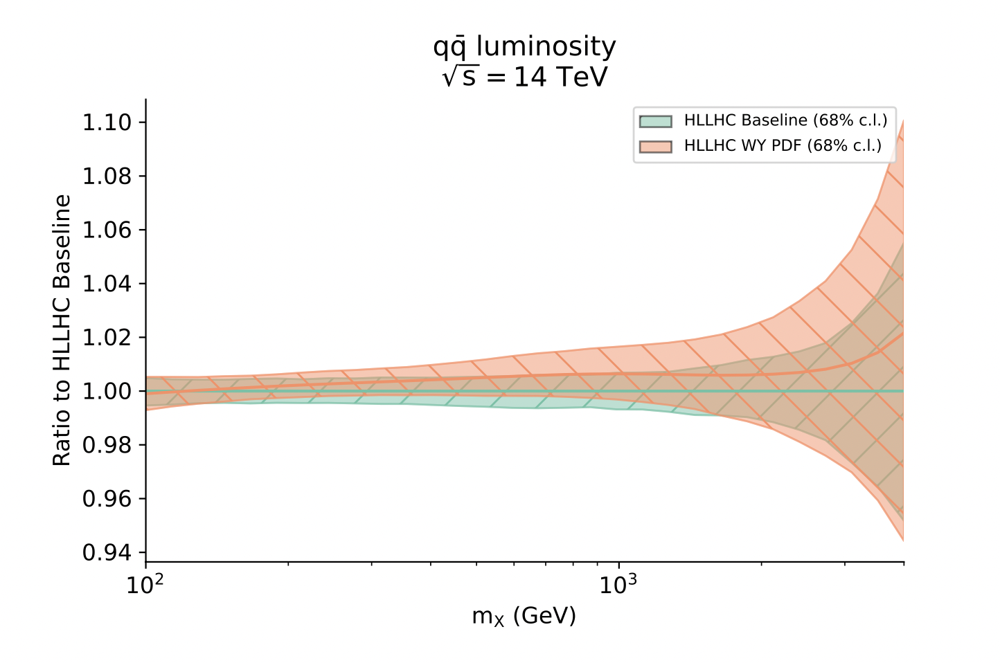

The Drell-Yan sector
=====================================================
The high-energy tails of charged- and neutral-current Drell-Yan processes provide 
important constraints on the light quark and anti-quark PDFs in the large-:math:`x` region,
and on four-fermion operators of the SMEFT.

In Ref. :cite:`Iranipour:2022iak`, the SIMUnet code was used to perform a simultaneous
PDF and SMEFT fit to high-mass Drell-Yan data, including projections for the
High-Luminosity LHC.
The PDFs are fit simultaneously alongside the electroweak oblique
corrections (:math:`\hat W, \hat Y`). 

Below, we display results from this study.
See Ref. :cite:`Iranipour:2022iak` for more details and results, and Refs. :cite:`Greljo:2021kvv` and :cite:`Carrazza:2019sec`
for related work on simultaneous fits of Drell-Yan and deep inelastic data.

HL-LHC Projections
--------------------------------
First, we display the values of (:math:`\hat W, \hat Y`) resulting from the simultaneous fit, compared
to those obtained from a fixed SM PDF fit.  The scatter plot below indicates that,
by ignoring the interplay between PDFs and new physics, we may significantly underestimate
the constraints on the EFT parameter space.  This is particularly true for the :math:`\hat W` parameter
as shown from the marginal distribution.

.. figure:: ../images/results/simunet-DY-WY.png
    :width: 100%
    :class: align-center
    :figwidth: 100%
    :figclass: align-center

    Scatter plot for best fit tuples of (W, Y ) for each replica obtained in the simultaneous fit (green) compared to those obtained when PDFs are kept fixed to the SM baseline (orange).

Secondly, the PDF resulting from the simultaneous fit is shown below and compared to the baseline SM PDF fit.
We observe that, while the central value of the PDF shifts only slightly, the PDF uncertainty is markedly broadened
by the simultaneous fit.

    :math:`q \bar{q}` luminosity channel of the PDF fitted in the presence of :math:`\hat W` and :math:`\hat Y` parameters fitted to the ATLAS and CMS high mass Drell-Yan data and the neutral current and charged current DY HL-LHC projections, normalized to the appropriate baseline SM PDF.

