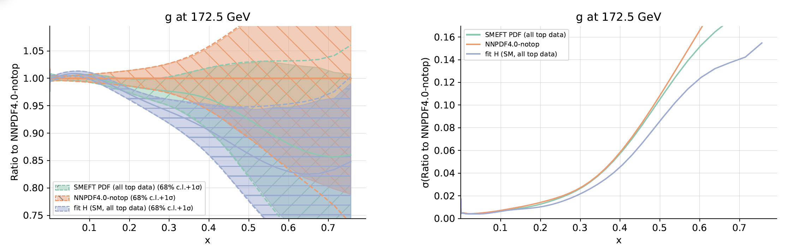
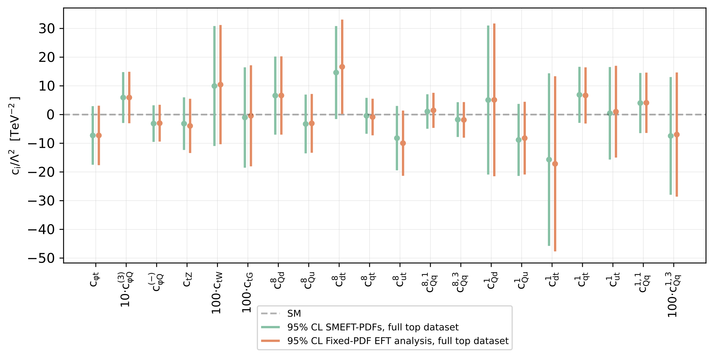

Simultaneous SMEFT and PDF fits
=================================

Here we provide the results of a simultaneous 
PDF and SMEFT determination in the top sector.

The simultaneous PDF and SMEFT fit shown here can be reproduced using
the SIMUnet methodology: see :ref:`the tutorials section<tutorials>` for more details.

Below, we show the PDF resulting from the simultaneous fit in green.  This SMEFT PDF
is compared two SM PDF fits: NNPDF4.0-notop (no top data) and fit H (all top data),
both of which are discussed in more detail in the :ref:`SM PDFs<smpdfs>` section.

We observe that the impact of the top quark data on the large-x gluon PDF is
diluted in the simultaneous fit: the Wilson coefficients reabsorb some of the constraining
power of the top sector.

    Comparison between a SMEFT PDF and SM PDFs (left) and their uncertainties (right).

|
|

The constraints on the Wilson coefficients of the SMEFT are shown below.
We compare the constraints from the simultaneous fit with the constraints from a fixed-PDF fit, and find that
the constrainst are stable.

    Constraints on 20 Wilson coefficients of the dimension-6 SMEFT at :math:`\mathcal{O}(\Lambda^{-2})`. 

|
|

