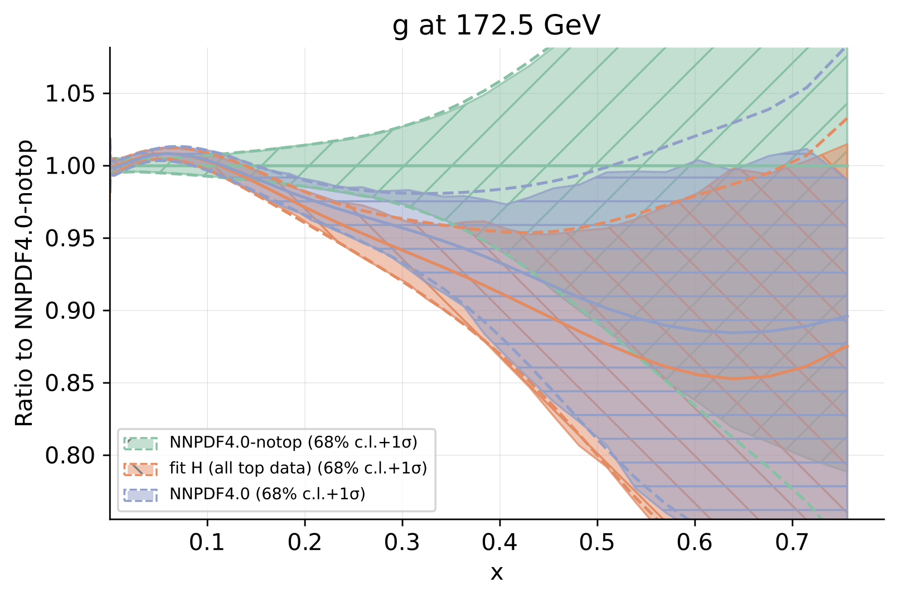
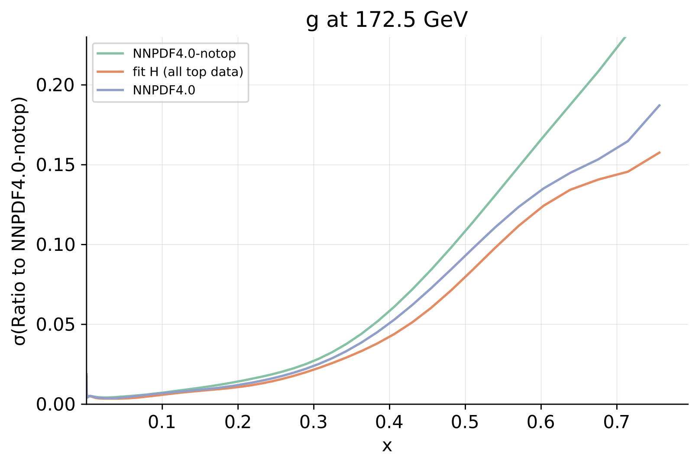
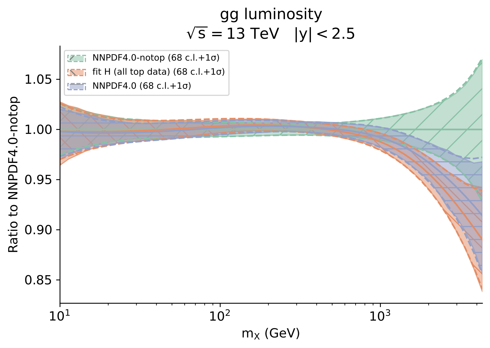
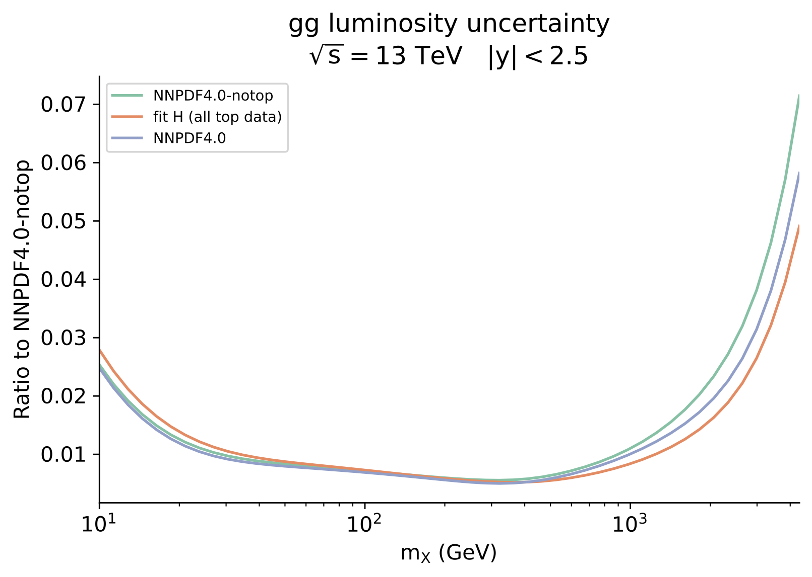

.. _smpdfs:

SM PDF fits
============================================================

The figures below demonstrate the impact of the top quark data on our study
on the gluon PDF.  
Three PDFs are compared:

- NNPDF4.0-notop: all top quark data excluded;

- Fit H: all top quark data in our study is included (see the :ref:`dataset<dataset>` section for a detailed list);

- NNPDF4.0: the NNPDF PDF set published alongside Ref. :cite:`NNPDF:2021njg`.

|
|

A comparison of the gluon PDF resulting from each fit
is displayed below, normalised to the central value of NNPDF4.0-notop.
On the right, the PDF uncertainties are compared.

We observe that the inclusion of top quark data has a marked impact on the gluon PDF,
particularly in the region :math:`x \in [0.1,0.5]`.  The central value of the PDF shifts
downwards, and the PDF uncertainty is reduced.

This effect is already observed in the comparison between NNPDF4.0 and NNPDF4.0-notop, however
it is clearly
enhanced by the inclusion of the latest top quark data.

  

|
|

The same comparison is made below at the level of the gluon-gluon luminosity.

|
|
