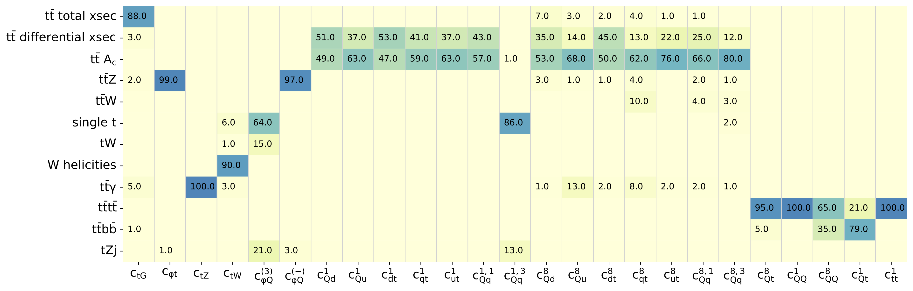
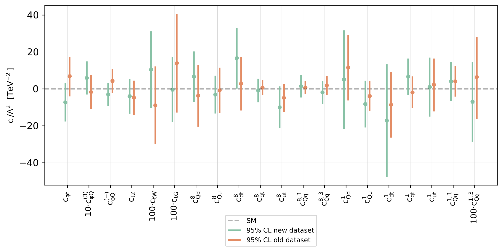
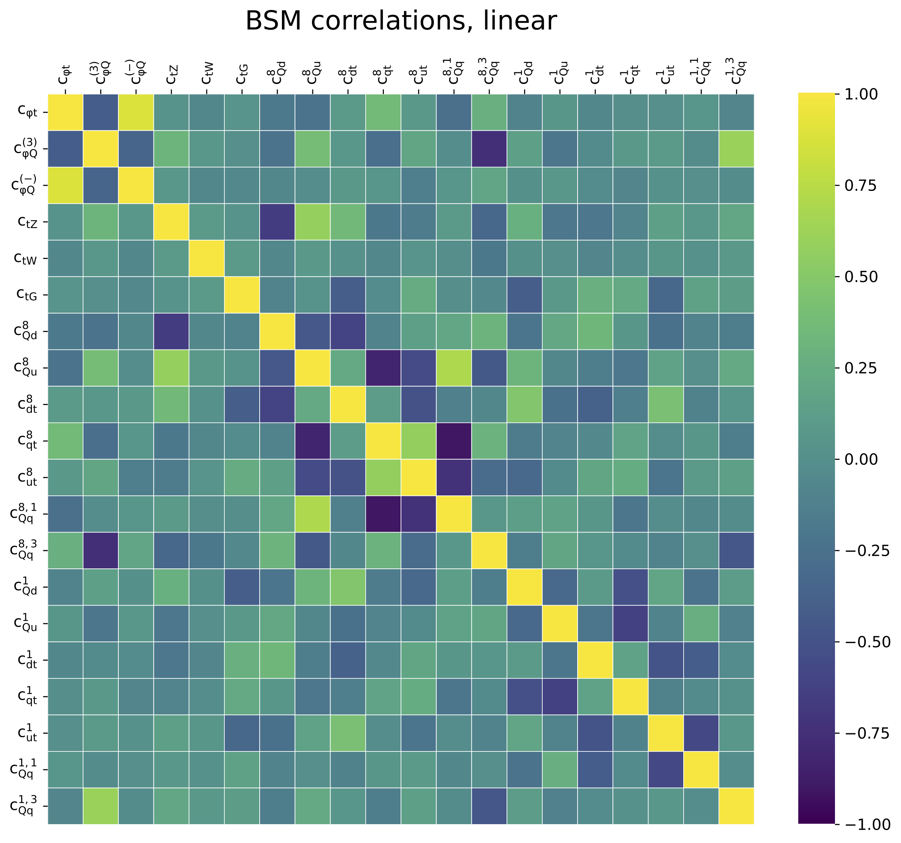
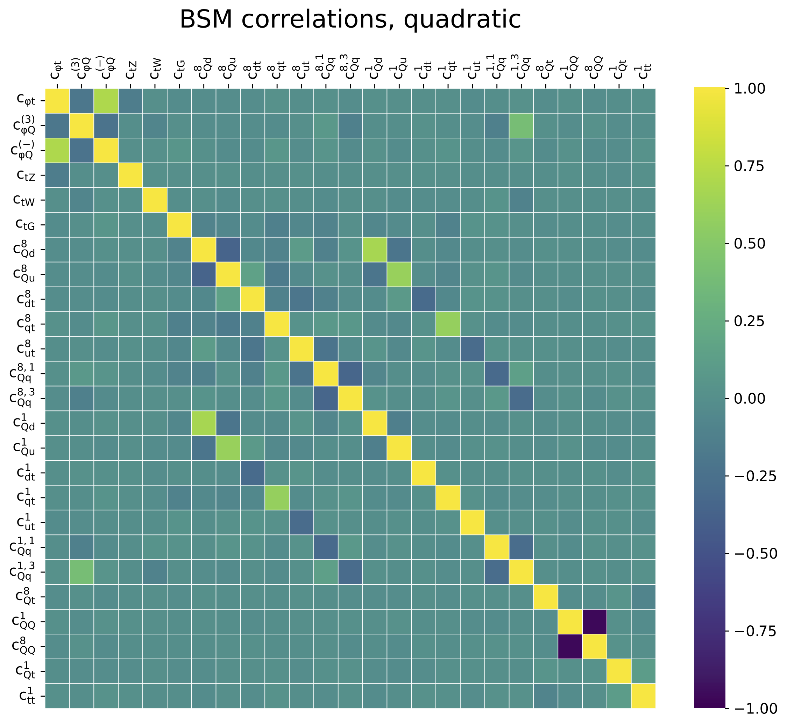

SMEFT-only fit
===============

We provide bounds on 25 Wilson coefficients of the dimension-6 SMEFT
relevant for LHC top quark observables.  

The relative constraining power (%) of each sector of top quark observables
on the SMEFT coefficients is shown below: see :cite:`Kassabov:2023hbm` for more details.

 

|
|

First, we show the results of a determination of these Wilson coefficients
at linear order (:math:`\Lambda^{-2}`).  Here we assume a fixed SM PDF as input
to our theoretical calculations.  This type of 'fixed-PDF' fit can be reproduced using
the SIMUnet methodology: see :ref:`the tutorials section<tutorials>` for more details.

    Constraints on 20 Wilson coefficients of the dimension-6 SMEFT at :math:`\mathcal{O}(\Lambda^{-2})`.

|
|

The results of the same fit, this time determined at quadratic order in the EFT expansion 
(:math:`\Lambda^{-2}`), are shown below.  As above, a fixed PDF set is used.

.. figure:: ../images/results/smeft_quad_nlo_comparison.png
    :width: 100%
    :class: align-center
    :figwidth: 100%
    :figclass: align-center

    Constraints on 25 Wilson coefficients of the dimension-6 SMEFT at :math:`\mathcal{O}(\Lambda^{-4})`.

|
|

Below, we highlight the correlations between the Wilson coefficients resulting from the fit:
on the left, we show the correlations arising at linear order, while the correlations in a quadratic fit are shown on the right.

|
|
