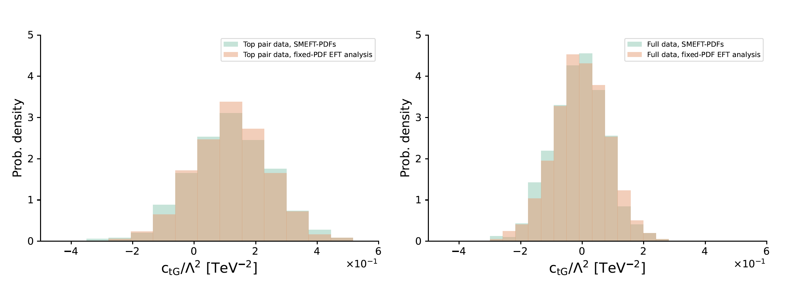
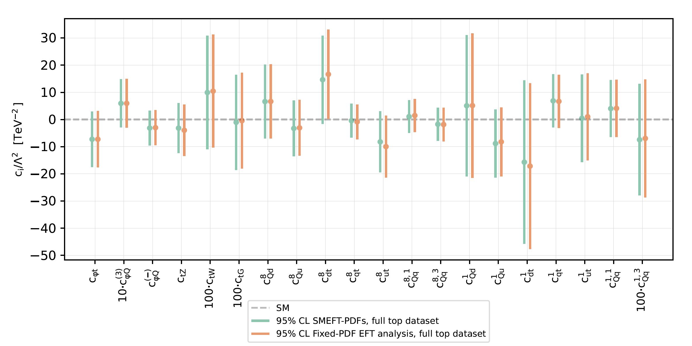
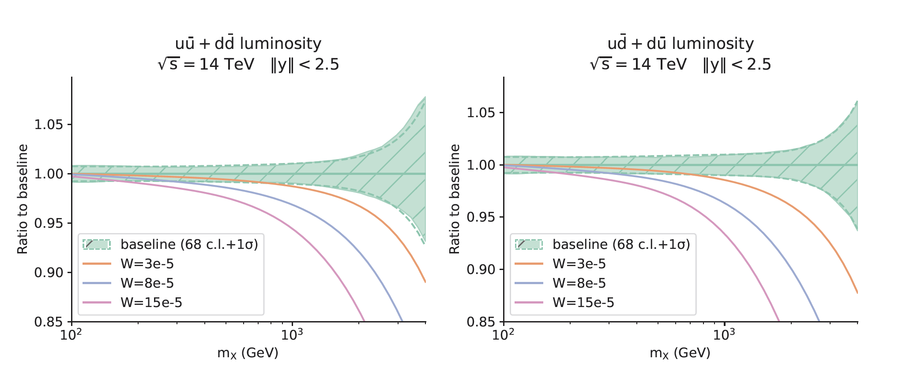
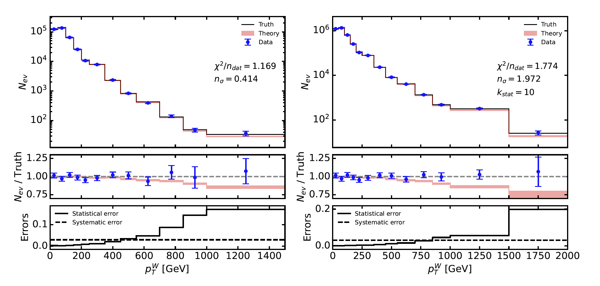
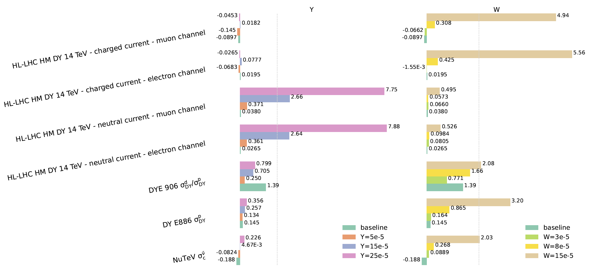

.. simunet documentation master file, created by
   sphinx-quickstart on Sun Jul  2 20:53:08 2023.
   You can adapt this file completely to your liking, but it should at least
   contain the root `toctree` directive.

===================================
SIMUnet
===================================

SIMUnet is a machine learning framework to perform fits of parton distribution functions (PDFs) and SMEFT Wilson coefficients. 
It is an open-source, flexible methodology that allows the user to perform simultaneous PDF-SMEFT fits, and fixed-PDF SMEFT fits using a global dataset.
It also provides analysis tools to evaluate different metrics of these fits, including quality metrics, uncertainties, PDF and SMEFT correlations, etc.

PDF and SMEFT fits
------------------

.. figure:: images/sm_smeft_pdf.png
    :width: 100%
    :class: align-center
    :figwidth: 100%
    :figclass: align-center

    *example figure*
    :label: fig-sm_smeft_pdf

    *example figure*
    :label: fig-ctg_plot

    *example figure*
    :label: fig-wilsons_summary

.. figure:: images/pdf_eft_corr.png
    :width: 100%
    :class: align-center
    :figwidth: 100%
    :figclass: align-center

    *example figure*
    :label: fig-pdf_eft_corr

Can PDFs absorb new physics?
----------------------------

.. figure:: images/np_values.png
    :width: 100%
    :class: align-center
    :figwidth: 100%
    :figclass: align-center

    *example figure*
    :label: fig-np_values

    *example figure*
    :label: fig-pdf_shift_lumis

    *example figure*
    :label: fig-cont_effects

    *example figure*
    :label: fig-cont_chi2

Contents
========
.. toctree::
   :maxdepth: 2

   methodology.rst
   tutorials/tutorials_overview.rst
   datasets.rst
   results/overview.rst

.. toctree::
   :maxdepth: 4
   :caption: Simunet Examples
   :hidden:

   tutorials.rst

.. toctree::
   :maxdepth: 4
   :caption: Simunet analysis tools
   :hidden:

   simunet_analysis.rst

.. toctree::
   :maxdepth: 4
   :caption: Bibliography
   :hidden:
   
   bibliography.rst

The PBSP team
----------------------------------
The team is currently composed by the following members: 

- Mark Costantini - University of Cambridge
- Elie Hammou - University of Cambridge
- Maeve Madigan - University of Heidelberg
- Luca Mantani - University of Cambridge
- James Moore - University of Cambridge
- Manuel Morales-Alvarado - University of Cambridge
- Maria Ubiali - University of Cambridge

Citation policy
----------------------------------
If you use the :math:`\text{SIMUnet}` code in a scientific publication, please make sure to cite: :cite:`Iranipour:2022iak` and ...

Indices and tables
=====================

* :ref:`genindex`
* :ref:`modindex`
* :ref:`search`

