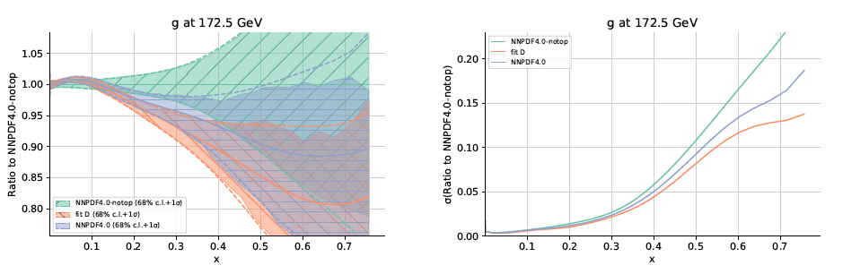

Top
=====================================================
We assess the impact of top quark production at the LHC on global analyses of parton distributions (PDFs) and of Wilson coefficients in the SMEFT, both separately and in the framework of a joint interpretation.
We consider the broadest top quark dataset to date containing all available measurements based on the full Run II luminosity. 
First, we determine the constraints that this dataset provides on the large-x gluon PDF and study its consistency with other gluon-sensitive measurements. 
Second, we carry out a SMEFT interpretation of the same dataset using state-of-the-art SM and EFT theory cal- culations, resulting in bounds on 25 Wilson coefficients modifying top quark interactions. 
Subsequently, we integrate the two analyses within the SIMUnet approach to realise a simul- taneous determination of the SMEFT PDFs and the EFT coefficients and identify regions in the parameter space where their interplay is most phenomenologically relevant. 
We also demonstrate how to separate eventual BSM signals from QCD effects in the interpretation of top quark measurements at the LHC.

Summary of results
------------

    *example figure*
    :label: fig-toppdf

